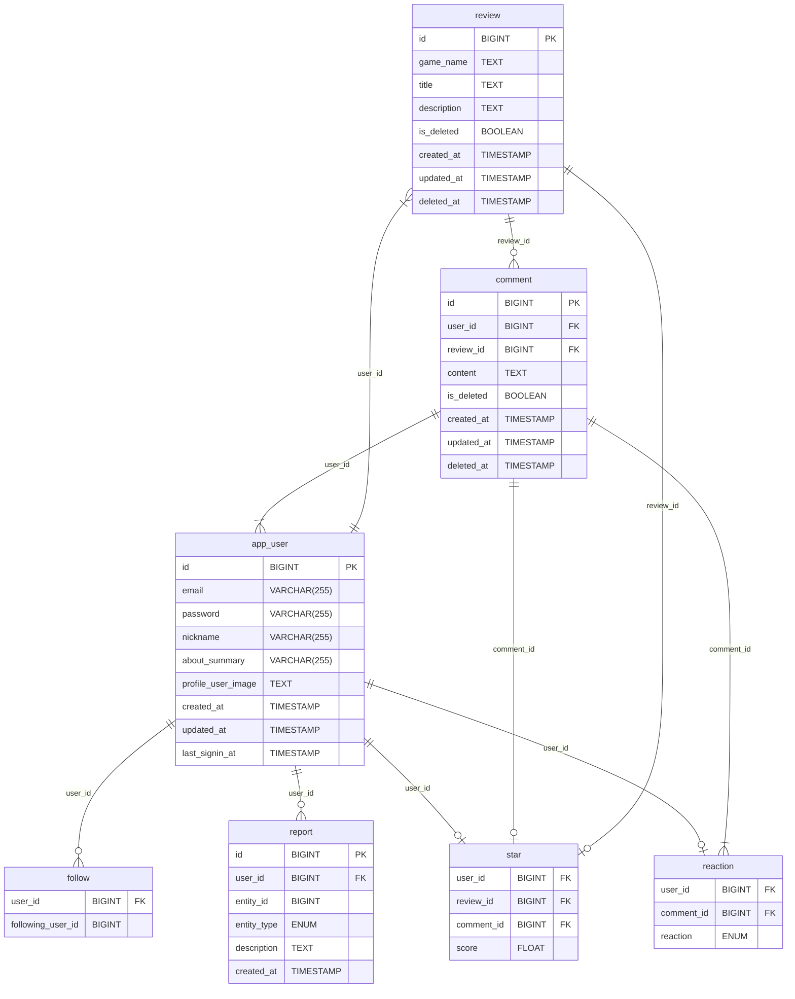

# gamenome-project-server

## 소개

- 게임에 관한 리뷰를 진행 하며 게임과 관련된 다양한 평가를 제공 하는 프로젝트 입니다

## 목차

## 1. 사전 작업
### [1-1. 이벤트 스토밍](#1-이벤트스토밍)
### [1-2. 와이어 프레임](#2-와이어프레임)
### [1-3. API 명세서](#3-API-명세서)
### [1-4. ERD](#4-ERD)
### [1-5. gamenome-project-conventions](#5-gamenome-project-conventions)
### [1-6. 역할 분담](#6-역할-분담)

## 2. 기능 설명
### [2-1. Review](#1-Review)
### [2-2. Comment](#2-Comment)
### [2-3. User, follow](#3-User_follow)
### [2-4. reaction, star](#4-reaction_star)
### [2-5. report](#5-report)
### [2-6. 기타 추가 기능](#6-기타-추가-기능)

## 1-이벤트스토밍

## 2-와이어프레임

## 3-API-명세서

## 4-ERD

[자세한 ERD 상세 정보 보기](https://www.erdcloud.com/d/2o4n8pSuC9zzytQvK)

## 5-gamenome-project-conventions

- Naming convention
    - URI 작성
        - 띄어쓰기는 - 를 사용 한다
        - 기본적 으로 소문자 를 사용 한다
        - 기본적 으로 복수형 (posts, comments) 을 사용 한다
        - Query parameter 는 camelCase → ex) ?userId=1 로 작성한다
        - 버저닝 관리 (/api/v1/)
            - 패키지 구조가 v1.{Controller, Service, Repository}
    - 변수명
    - 함수명
    - 생성자
        - 생성자는 명시적 으로 생성 한다  ex) Post(id = id, passowrd = passowrd, name = name)
    - Entity
        - @ColumnName(name=””, nullable=(false/true))
        - Mutable 여부는 var, val로 구분 한다
        - 날짜에 대한 어노테이션 으로 @CreationTimeStamp createdAt, @UpdateTimeStamp updatedAt 을 사용 한다
        - Soft delete 사용 한다 (Delete 쿼리는 지양하자)
- Git convention
    - PR
    - Commit

## 6-역할-분담

### 전체
- 코드 리펙터링 및 코드 리뷰

### 노재원
- `User Domain`에 대한 전체 적인 로직 작성
- 인증 과 인가 Jwt 구현
- 불변성 / 유효성 검증 및 세부 정책 구현
- 패스워드 암호화 구현
- 소셜 로그인 구현
- 전체 적인 코드 리펙터링
### 임성우
- `Review Domain`에 대한 전체 적인 로직 작성
- `Review` 및 `Comment` 신고 하기 기능 구현
- 이메일 및 닉네임 인증 부분 구현
- AWS S3 이미지 업로드 구현
### 김도균
- `Comment Domain`에 대한 전체 적인 로직 작성
- 코맨트에 좋아요 / 싫어요 기능 구현
- PageNation 및 SoftDelete 구현
- 게임 리뷰 별점 주기 기능 구현
- 유저 팔로잉 기능 구현
- HTTPS 업그레이드 구현 <- 도메인 이슈로 보류

# 기능 설명

## 1-Review

## 2-Comment
## 3-User_follow
## 4-reaction_star
## 5-report
## 6-기타-추가-기능