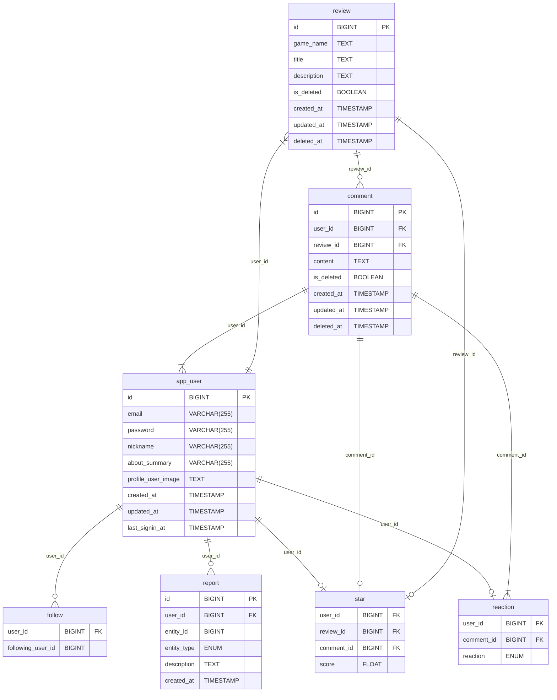
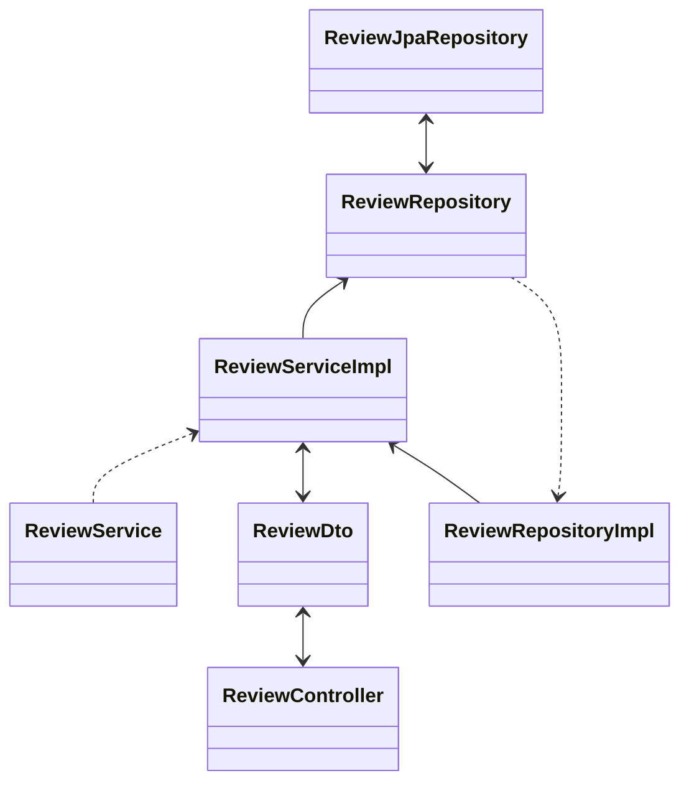
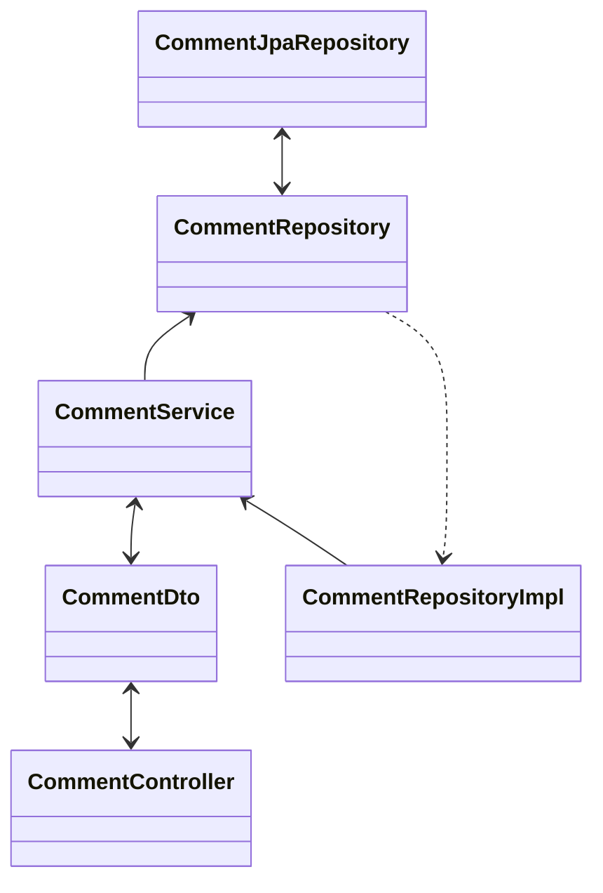
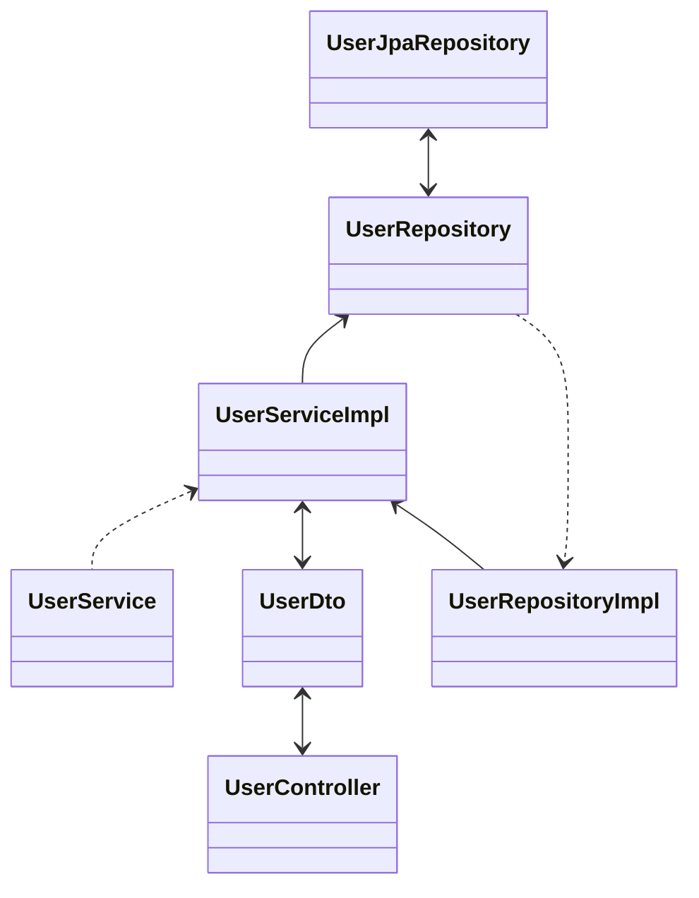
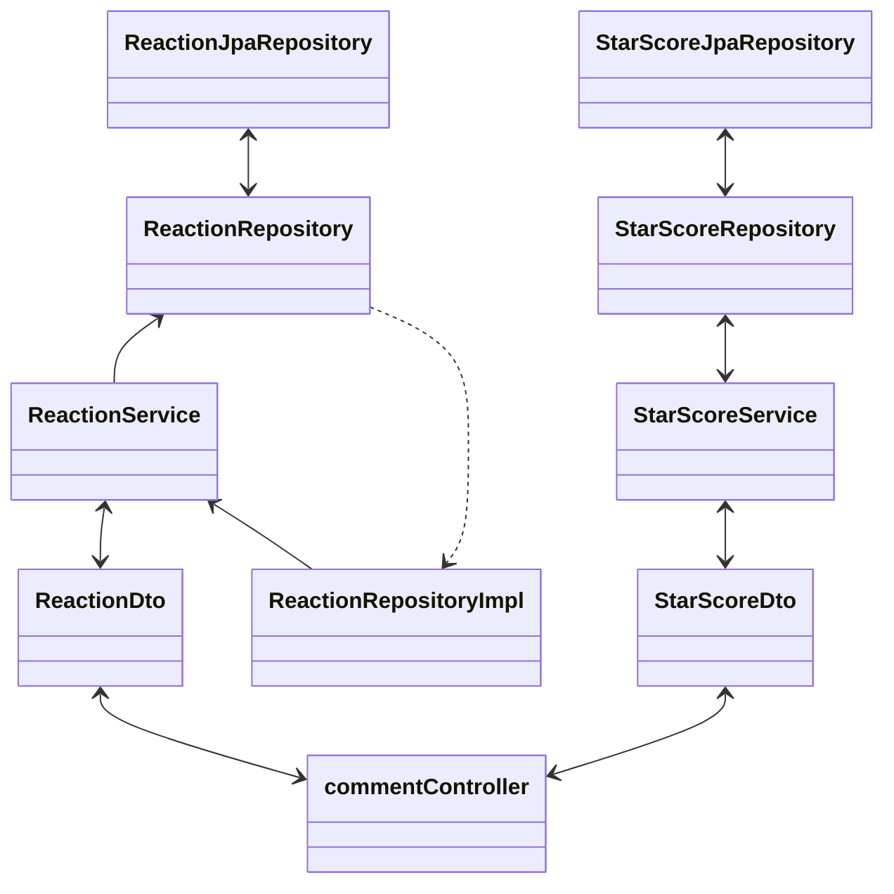
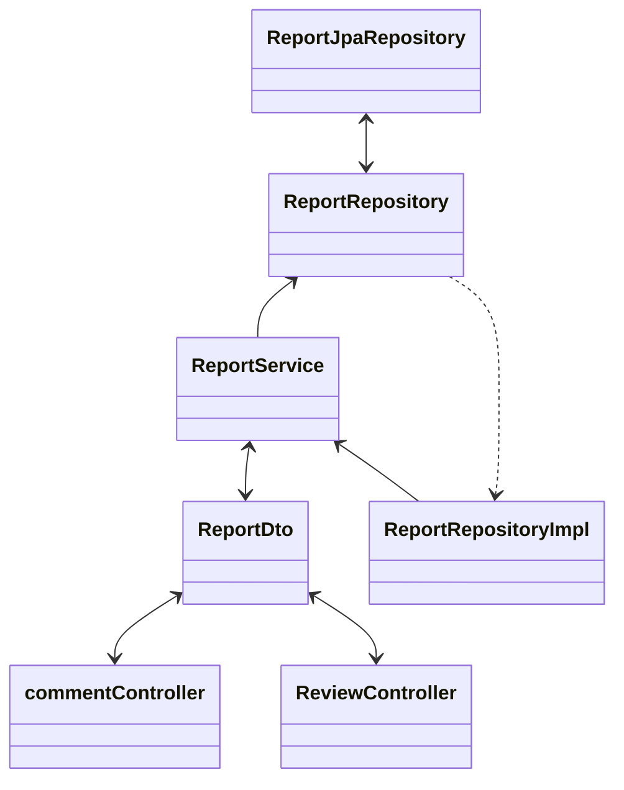
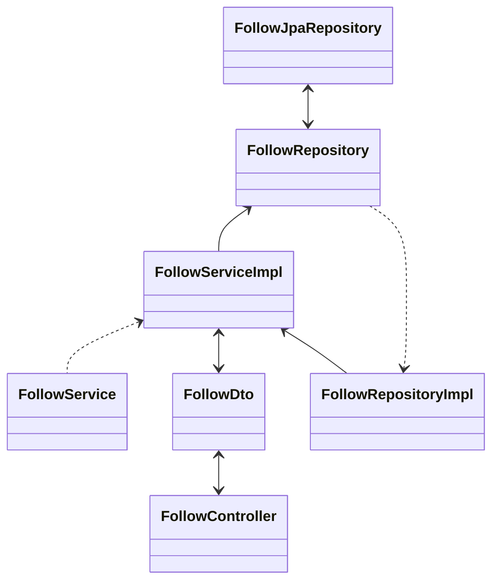

# gamenome-project-server

## 소개

- 게임에 관한 리뷰를 진행 하며 게임과 관련된 다양한 평가를 제공 하는 프로젝트 입니다

## 목차

## [1. 사전 작업](#1-사전-작업)
## 2. 기능 설명
### [2-1. Review](#1-Review)
### [2-2. Comment](#2-Comment)
### [2-3. User](#3-User)
### [2-4. reaction, star](#4-reaction_star)
### [2-5. report](#5-report)
### [2-6. report](#6-follow)
### [2-7. 기타 추가 기능](#7-기타-추가-기능)
### [2-8. 버그 및 이슈 사항](#8-버그-및-이슈-사항)
## [3. 환경 변수](#3-환경-변수)

# 1-사전-작업

## 1-1. 이벤트 스토밍

이벤트 스토밍 보기

    

## 1-2. 와이어 프레임

와이어 프레임 보기

    
    
    
    

## 1-3. API 명세서

API 명세서 보기

    
    
    

## 1-4. ERD

[자세한 ERD 상세 정보 보기](https://www.erdcloud.com/d/2o4n8pSuC9zzytQvK)

## 1-5. gamenome-project-conventions

- Naming convention
    - URI 작성
        - 띄어쓰기는 - 를 사용 한다
        - 기본적 으로 소문자 를 사용 한다
        - 기본적 으로 복수형 (posts, comments) 을 사용 한다
        - Query parameter 는 camelCase → ex) ?userId=1 로 작성한다
        - 버저닝 관리 (/api/v1/)
            - 패키지 구조가 v1.{Controller, Service, Repository}
    - 변수명
    - 함수명
    - 생성자
        - 생성자는 명시적 으로 생성 한다  ex) Post(id = id, password = password, name = name)
    - Entity
        - `@ColumnName(name=””, nullable=(false/true))`
        - Mutable 여부는 var, val로 구분 한다
        - 날짜에 대한 어노테이션 으로 @CreationTimeStamp createdAt, @UpdateTimeStamp updatedAt 을 사용 한다
        - Soft delete 사용 한다 (Delete 쿼리는 지양하자)
- Git convention
    - PR
    - Commit

## 1-6. 역할 분담

### 전체
- 코드 리펙터링 및 코드 리뷰

### 노재원
- `User Domain`에 대한 전체 적인 로직 작성
- 인증 과 인가 Jwt 구현
- 불변성 / 유효성 검증 및 세부 정책 구현
- 패스워드 암호화 구현
- 소셜 로그인 구현
- 전체 적인 코드 리펙터링
### 임성우
- `Review Domain`에 대한 전체 적인 로직 작성
- `Review` 및 `Comment` 신고 하기 기능 구현
- 이메일 및 닉네임 인증 부분 구현
- AWS S3 이미지 업로드 구현
### 김도균
- `Comment Domain`에 대한 전체 적인 로직 작성
- 코맨트에 좋아요 / 싫어요 기능 구현
- PageNation 및 SoftDelete 구현
- 게임 리뷰 별점 주기 기능 구현
- 유저 팔로잉 기능 구현
- HTTPS 업그레이드 구현 <- 도메인 이슈로 보류

# 기능 설명

## 패키지 구조

## 1-Review

- 게임에 대한 평가를 CRUD 할 수 있는 기능을 포함 했습니다
- 리뷰를 조회 할 경우에 평균 평점을 계산 하여 조회 합니다
- 게임에 대한 특정 게시물 이나 모든 게시물을 다 조회할 수 있습니다 
- 또한 악성 글을 작성한 유저를 신고 하는 기능과 팔로잉 한 유저의 게시물을 필터링 하여 보여 줄 수 있는 기능을 포함 했습니다
- 게임 리뷰에 대한 정보는 Soft Delete 기능을 사용 하여 추후에 복원이 가능하게끔 설계를 하였습니다
- 게임 리뷰를 작성할 시에 게임 이름은 100자 내외, 제목은 200자 내외, 내용은 2000자 내외로 작성 해야 합니다

## 2-Comment

- 리뷰에 대한 평가를 댓글로 CRUD 할 수 있는 기능을 추가 했습니다
- 리뷰 와는 달리 리뷰에 대한 모든 댓글을 불러 옵니다
- 코맨트를 조회할 때 좋아요와 싫어요, 유저가 준 평점을 같이 조회 합니다
- 코맨트도 리뷰와 마찬가지로 신고를 가능하게끔 하여 악성 글을 작성 하는 유저의 게시물을 필터링 하여 볼 수 있습니다
- 코맨트는 코맨트에 대한 유저들이 좋아요와 싫어요를 통해서 반응할 수 있습니다
- 코맨트는 대한 정보는 Soft Delete 기능을 사용 하여 추후에 복원이 가능하게끔 설계를 하였습니다 그러나 좋아요와 싫어요, 별점은 초기화 됩니다
- 코맨트는 200자 내외로 작성 해야 합니다

## 3-User

- 유저에 대한 정보를 저장 혹은 인증을 하는 공간 입니다
- 유저의 회원 가입과 회원 탈퇴를 진행 하며 유저의 로그인 로그아웃을 진행 합니다
- 회원 가입 시에 유저의 이메일과 닉네임이 중복 되지 않도록 처리 합니다
- 또한 이메일을 통한 유저의 인증 절차를 진행 하며 인증 코드를 통해서 이메일 인증을 완료 합니다
- 이메일은 이메일 검증을 확인 해야 하며 비밀 번호는 최소 8자 ~ 최대 50자 까지 입력이 가능 합니다
- Aws S3 기능을 통해서 유저의 프로필 이미지를 업로드 할 수 있게끔 구현 했습니다

## 4-reaction_star

- 유저가 코맨트에 대한 좋아요, 싫어요에 대한 정보를 저장 및 전달 합니다
- 1명의 유저는 하나에 댓글 에만 좋아요와 싫어요 둘 중 하나만 달 수 있습니다
- 평점은 총 5점 만점 이며 0.5점씩 부여가 가능 합니다
- 하나의 댓글 당 하나의 평점 만이 작성이 가능 합니다 
- commentController 가 댓글을 작성할 경우에 좋아요와 싫어요, 평점을 선택 및 입력 수 있습니다
- commentController 가 댓글을 변경할 경우에 좋아요와 싫어요, 평점을 변경할 수 있습니다
- commentController 가 댓글을 삭제할 경우에 좋아요와 싫어요, 평점이 자동 으로 삭제 됩니다

## 5-report

- 리뷰와 코맨트에 악성 글이 작성될 경우에 신고를 하는 기능 입니다
- 리뷰와 코맨트 모두 5회 초과 신고 접수 이후 에는 조회 에서 제외 됩니다
- 신고 내용은 200자 내외로 작성 해야 합니다

## 6-follow

- 유저는 특정 유저를 팔로우 할 수 있습니다
- 유저는 팔로우한 유저의 목록을 볼 수 있으며 팔로우한 유저의 게시글만 볼 수 있습니다

## 7-기타-추가-기능

### HTTP -> HTTPS 업데이트
### KAKAO OAuth 인증
### JWT 토큰 인증

## 8-버그-및-이슈-사항

# 3-환경-변수

개발 언어 : Kotlin 1.9.23, JDK 21

IDE : IntelliJ IDEA 2024.2

Build tool : Gradle.kts

FrameWork : Spring Boot 3.2.5

Library : Springdoc 2.5.0

DataBase : PostgresQL 14.1 with Supabase