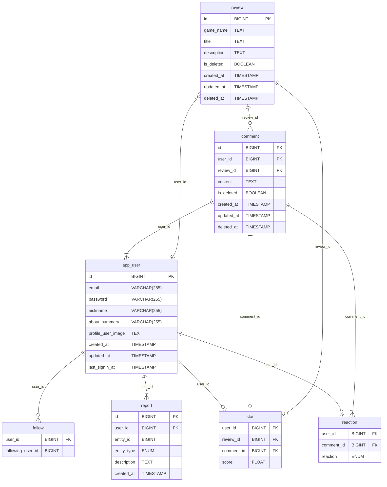

# gamenome-project-server

## 소개

- 게임에 관한 리뷰를 진행 하며 게임과 관련된 다양한 평가를 제공 하는 프로젝트 입니다

## 목차

## 1. 사전 작업
#### 1-1. 이벤트 스토밍
#### 1-2. 와이어 프레임
#### 1-3. API 명세서
#### 1-4. ERD
#### 1-5. gamenome-project-conventions
#### 1-6. 역할 분담

## 1-1. 이벤트 스토밍
## 1-2. 와이어 프레임

//사진 1 ~ 4

## 1-3. API 명세서

//사진1 ~ 3

## 1-4. ERD

[자세한 ERD 상세 정보 보기](https://www.erdcloud.com/d/2o4n8pSuC9zzytQvK)

## 1-5. gamenome-project-conventions
## 1-6. 역할 분담